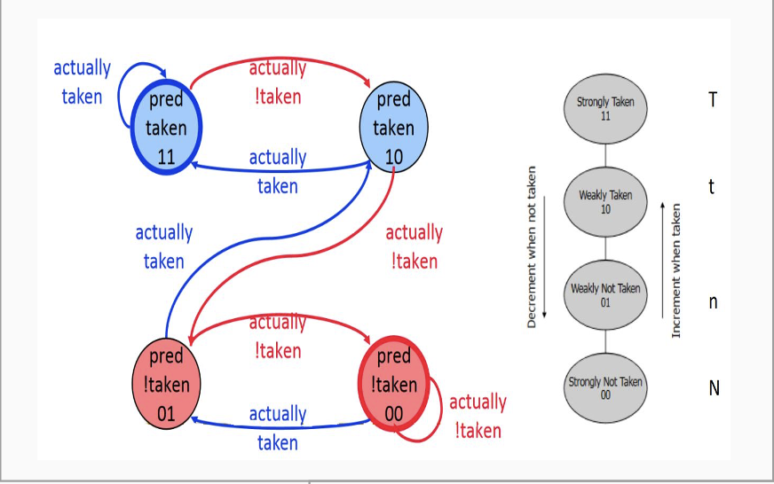
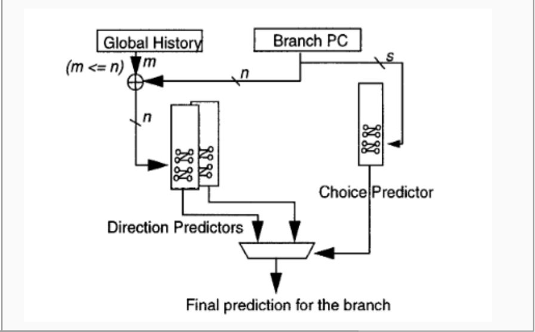
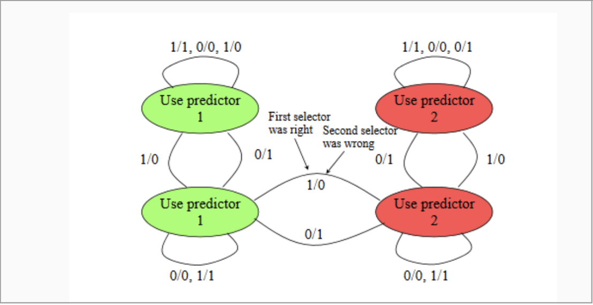
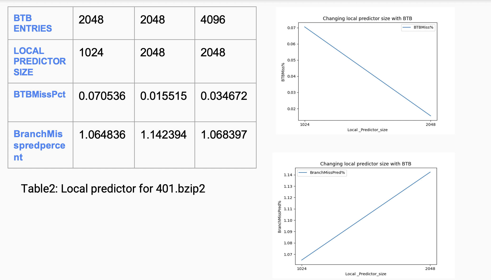
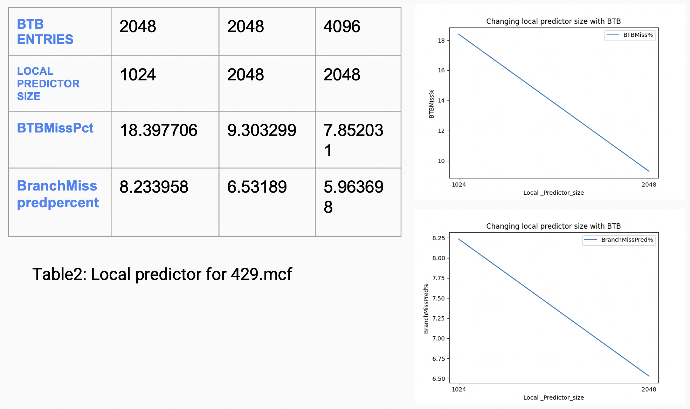
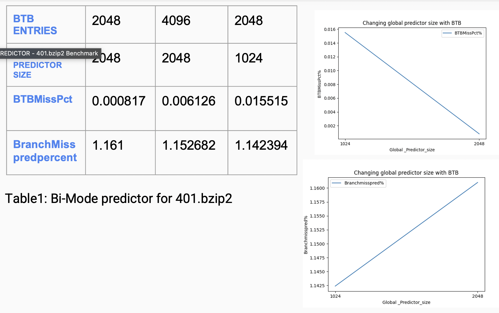
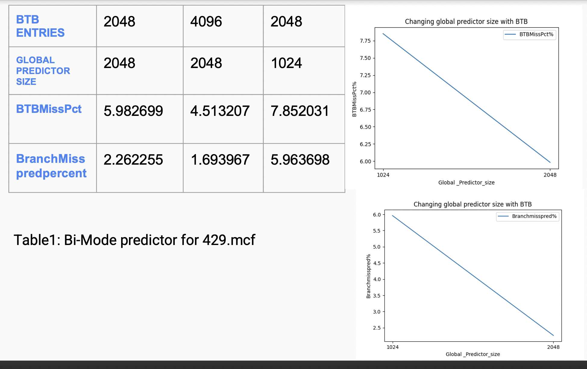
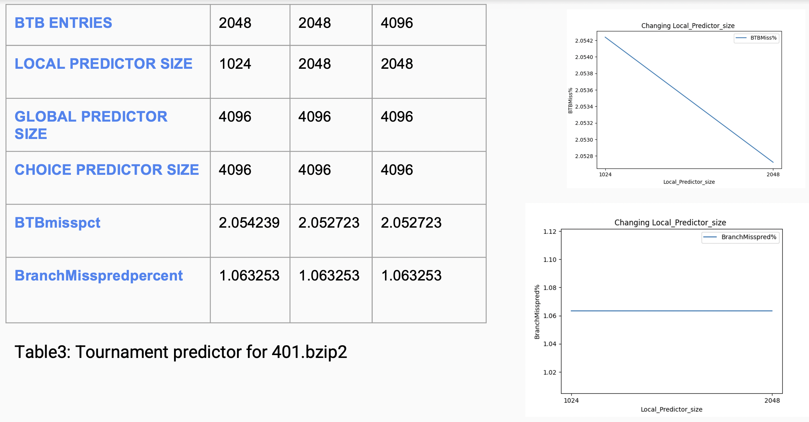
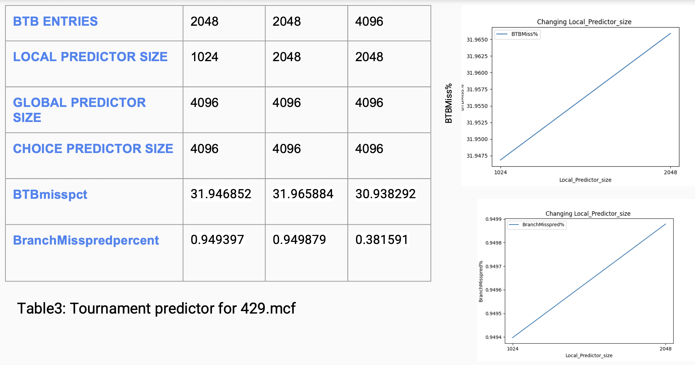

# Branch Predictor
A Branch Predictor is a digital circuit that tries to guess which way a branch will go before this is known definitively.  
Branch prediction enables the processor to begin executing instructions long before the branch outcome is certain to reduce Branch delay penalty

## Objective
Study the effect of varying Branch Prediction parameters on different benchmarks using GEM5 simulator for 3 distinct Branch predictors

## Branch Predictors Used
1. LOCAL PREDICTOR
- The 2-bit scheme is a specialization of a more general scheme which has an n-bit saturating counter for each entry in the prediction buffer.
- It works better if the branches move in the same direction 
- Make a prediction based on the outcome of the branch the last time the same local branch history was encounter  




2. BI-MODE PREDICTOR
- It divides the prediction tables into two halves and by dynamically determining the current "mode" of the program, selects the appropriate half of the table for prediction.
- It is shown to preserve the merits of global history-based prediction while reducing destructive aliasing and as a result improving the prediction accuracy




3. TOURNAMENT PREDICTOR
- Combination of one global and one local predictor
- The tournament predictor chooses correct predictor for a given conditional branch 




## Results: 
1. Local Predictor with 401 benchmark



2. Local Predictor with 429 benchmark



3. Bi Mode Predictor with 401 benchmark



4. Bi Mode Predictor with 429 benchmark
 


5. Tournament Predictor with 401 benchmark
 


6. Tournament Predictor with 429 benchmark



# FORMULA USED: 
```
BTBMissPct = (1 - (BTBHits/BTBLookups)) * 100 

where:    
                BTB Hits   ->   total number of BTB Hits 
                BTBLookups ->   total number of BTB References 


BranchMispredPercent = (numBranchMispred / numBranches) * 100; 

where:   
               numBranchMispred -> total number of mispredicted Branches 
               numBranches      -> total number of branches fetched


```

# CONCLUSION 
- On observation, for 401.bzip2 benchmark, Bi-Mode branch predictor produced the least BTBMiss% and BranchMissPred%. Also, the BranchMissPred% values produced by Bi-Mode and Local branch predictors were comparable.    

- For 429.mcf Benchmark, Bi-Mode branch predictor produces the least BTBMiss% however, Tournament branch predictor produced the best result in terms of BTBMissPred%.

- On changing the sizes of the localBP and local, global and choice predictor sizes for the tournament predictor and global and choice for BiModeBP it is inferred that when the global predictor size is high the BranchMisprediction Percent is found to be low.

- On increasing BTB Entries for each Branch predictor, it is observed that both BTBMissPct and BranchMispredPct are decreased.
